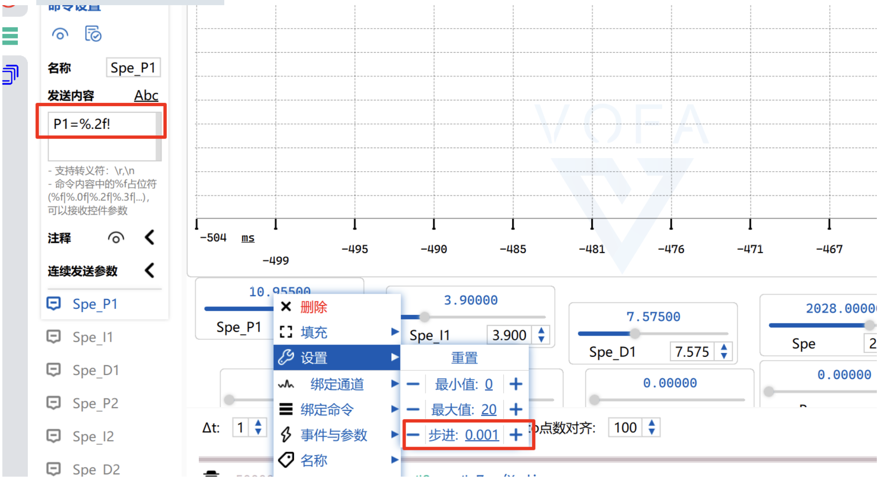
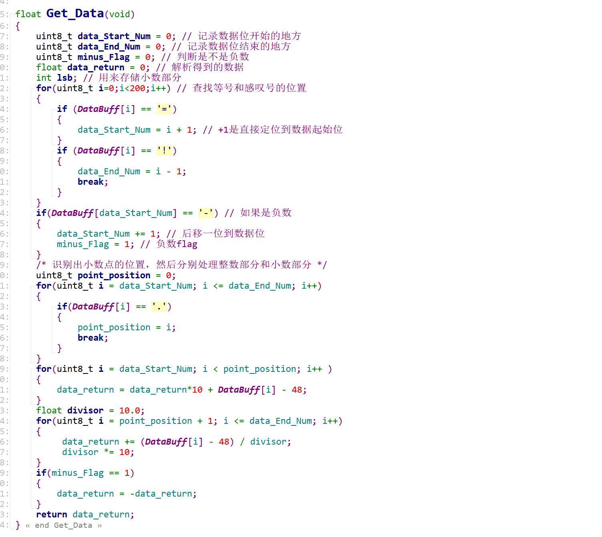
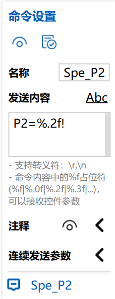
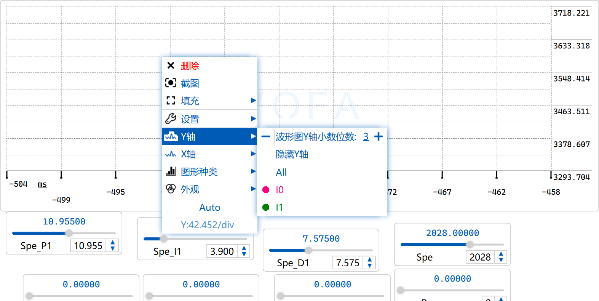

### 功能：

- pid上位机调参，实时打印曲线，烧一次就可以直接在上位机调，无需重复烧录！

### vofa+的使用

- 自行查看CSDN文章了解界面如何布局和使用

- 有一个注意的点：就是必须要关注你控件步进的步数和你指令的小数点位数的一定要对应，不要说你的指令只有两位小数，而控件却要求每次改变0.0001，这会导致发送数据解析混乱！

  

### 重点关注如何设置发送指令和接收指令

- 设置接收指令：

  1. 接收数据，关联串口，这里我写了一个driver_usart.c，用来重定向输入输出到串口1，并且将接收数据的工作写到了一个接收中断回调函数中，当然可以使用别的串口，记得在driver_usart.c中将关于串口1的配置改为你想用的串口序号就行

  2. 处理数据，这里写了一个pid_adjust.c 在这里对接收到的指令进行处理，直接移植就好了

     注意：这里所用的解析指令最多只能解析到6位小数

     

     这里的void USART_PID_Adjust(uint8_t motor_n)就是用来解析你写的指令，注意和你写的指令一一对应
  
     
  
     
  
  3. 设计发送指令：嫌麻烦可以按我写的来，就按我的格式写，如果有新的电机要加入，也模仿抄一下就可以了
  
     当然设计完不要忘了在USART_PID_Adjust里面添加新写的指令解析
  
  4. 然后就基本可以了，不出意外的话……
  
     

### 程序有哪些需要注意的点

- 注意调用这几个初始化函数

  

- 注意打印曲线的格式:其实就是==注意换行罢了，不然解析不到数据==

  